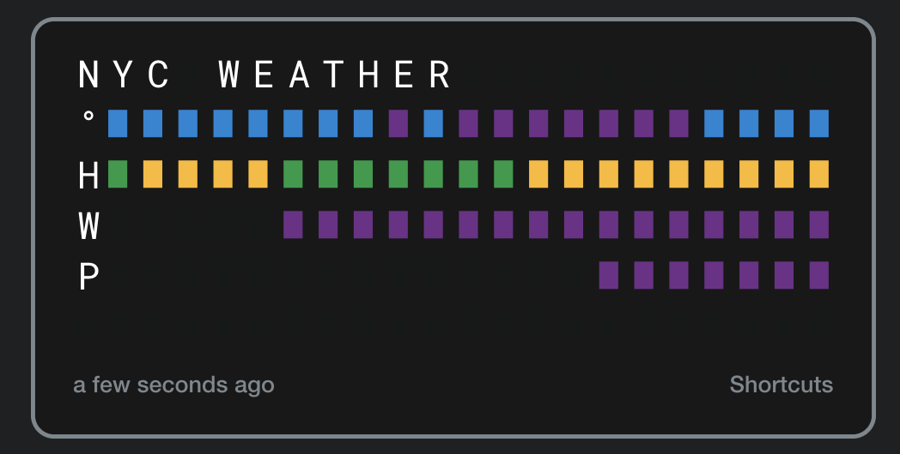

A node package that allows you to display a visual representation of the weather on your Vestaboard, using colors to indicate intesnsity of each of four measurements: temperature, humidity, wind, and precipitation.

As it stands, it's an MVP for me (with NYC weather hard-coded), but I aim to clean it up and allow configuration.

This is designed as a node function so that I could put it up on a web endpoint (I've got it hosted at a Next.JS API endpoint on Vercel) and use shortcuts on iOS to request the weather, integrating it into my home automation setup.

